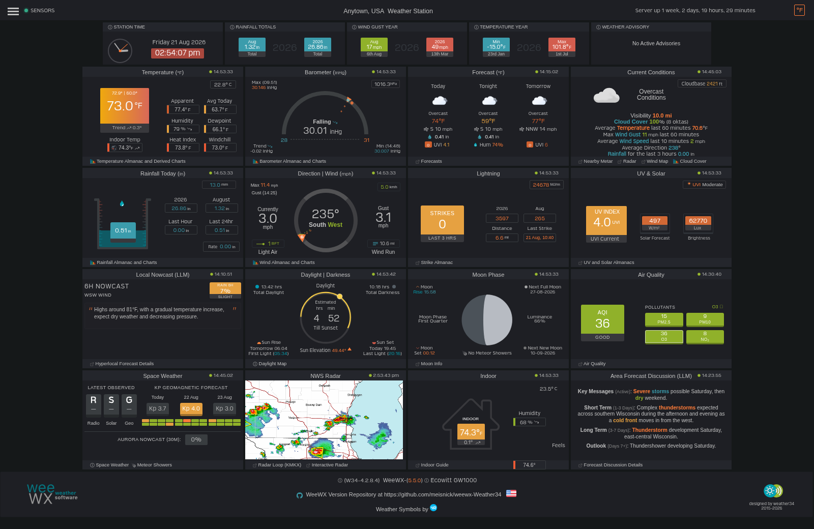

# Weather34 for WeeWX

**A modern, modular self-hosted weather dashboard skin for [WeeWX](https://weewx.com/) 5.**
Theme-aware, drag-and-drop customizable, with live radar, air quality, lightning, space
weather, and AI-summarized forecast discussions — all powered by free, keyless data sources.


> A community-maintained fork of the original weewx-Weather34 skin. The upstream project
> reached end-of-life in August 2023; this fork keeps it working on modern WeeWX 5, PHP 8.4,
> and Python 3.13, and rebuilds it around a fully modular, customizable dashboard.



---

## Overview

Weather34 for WeeWX turns an [Ecowitt GW1000/GW2000](https://github.com/weewx-contrib/weewx-gw1000)
gateway (or any WeeWX-supported station) into a rich, self-hosted weather site. Sensor data is
collected by the WeeWX daemon; a flat PHP frontend renders it as a live dashboard of modular
"cards," each independently styled and rearrangeable. Supplemental data (forecasts, METAR, alerts,
air quality, radar, space weather) comes entirely from **free, officially maintained sources** —
no paid or deprecated APIs.

## Features

- **🧩 Modular dashboard** — every card is a self-contained module with scoped `.mod-*` CSS. No
  monolithic stylesheet, no selector bleed between cards.
- **🖱️ Live drag-and-drop layout editor** — toggle edit mode and rearrange cards directly on the
  grid ([SortableJS](https://github.com/SortableJS/Sortable)); arrangements save instantly. Lock
  the layout and choose 3 / 4 / 6 / auto grid columns on the fly.
- **🌗 Full light/dark theme engine** — theme-aware stylesheet pairs applied across the whole page,
  including the settings UI.
- **📡 Live NWS radar** — polished radar module with real-time station picking, dark-mode
  inversion, zero-flash double-buffered loop transitions, and an interactive pan/zoom popup.
- **🌫️ Air quality** — two-column module with per-pollutant pills (PM2.5, PM10, NO₂, SO₂, O₃, CO),
  a tabbed details popup, and a historical AQI trend chart.
- **⚡ Lightning (v2)** — live strike statistics from the archive database, distances in miles,
  high-contrast badge + strike-history layout.
- **🌌 Space Weather** — real-time NOAA OVATION 30-minute auroral-visibility probability alongside
  the Kp index.
- **🤖 AI Forecast Discussion** — a local [Ollama](https://ollama.com/) (`gemma3:1b`) summarizer
  distills the NWS Area Forecast Discussion right onto the dashboard, plus a short-term Local
  Nowcast card.
- **📈 Highcharts history popups** for temperature, wind, rain, barometer, solar/UV and more.
- **🔔 Dashboard notifications** — toast alerts for low battery, UV caution, heat exhaustion, wind
  advisory/warning, wind chill, and freezing dewpoint.
- **🌍 Internationalized** — localized module titles and Beaufort-scale descriptions via `$lang[]`.
- **🆓 Free & keyless data** — Open-Meteo, NOAA Aviation Weather METAR, and NWS alerts require no
  API key; only optional extended forecast / AQI use free tokens.

## Branches

| Branch | WeeWX | PHP | Python | OS | Status | Description |
|--------|-------|-----|--------|----|--------|-------------|
| **`main`** | 5.5.0 | 8.4 | 3.13 | Debian 13 Trixie 64-bit | **Active** | The modular skin — dynamic layout engine, modular CSS, theme engine, Space Weather & LLM forecast |
| `main-legacy` | 5.5.0 | 8.4 | 3.13 | Debian 13 Trixie 64-bit | Preserved | Previous upstream-compatible standard layout (pre-modularization) |
| `legacy-4.x` | 4.10.2 | 8.1 | 3.9 | Debian 11 Bullseye | Frozen | Traditional steepleian-style WeeWX 4 releases |

## Requirements

- **WeeWX** 5.x (tested 5.5.0)
- **PHP** 8.2+ with `mbstring` (tested 8.4 via `php-cli` + Apache)
- **Python** 3.9+ (tested 3.13)
- **OS** Debian 12 Bookworm or 13 Trixie (64-bit recommended)
- **Station** Ecowitt GW1000 / GW2000 via [weewx-contrib/weewx-gw1000](https://github.com/weewx-contrib/weewx-gw1000)
  (any WeeWX-supported hardware works; some cards assume GW1000 fields)
- **Optional** [Ollama](https://ollama.com/) with `gemma3:1b` for the Forecast Discussion module

## Getting Started

Full step-by-step setup from a bare Pi — WeeWX install, GW1000 driver, skin deploy, cron jobs,
and the optional Space Weather / LLM modules — is in **[INSTALLATION.md](INSTALLATION.md)**.

The short version:

```bash
# 1. Install WeeWX 5 (see INSTALLATION.md for the apt repo key setup)
sudo apt install weewx python3-packaging python3-six php8.4-mbstring

# 2. Install the GW1000 driver
sudo weectl extension install --yes \
  https://github.com/weewx-contrib/weewx-gw1000/archive/refs/heads/master.zip

# 3. Deploy the skin
sudo git clone https://github.com/meisnick/weewx-Weather34.git /var/www/html/weewx/weather34
sudo chown -R www-data:www-data /var/www/html/weewx/weather34

# 4. Create your local station config (gitignored — never committed)
cd /var/www/html/weewx/weather34
cp scripts/w34config.example.py scripts/w34config.py
# then edit scripts/w34config.py with your lat/lon, ICAO code, and NWS alert zones
```

Then configure `/etc/weewx/weewx.conf` (start from `weewx5.conf.example`) and set up the cron
scripts that fetch forecast, METAR, alerts, cloud cover, and air quality. See
[INSTALLATION.md](INSTALLATION.md) for the complete procedure and
[TROUBLESHOOTING.md](TROUBLESHOOTING.md) if something looks off.

Already running WeeWX 4 or an older Weather34 fork? See **[MIGRATION.md](MIGRATION.md)**.

---

## Data Sources & Attribution

All supplemental data comes from free, officially maintained sources. Paid and deprecated APIs
(AerisWeather, CheckWX, sat24, EU MeteoAlarm) were removed.

| Source | Purpose | License |
|--------|---------|---------|
| [Open-Meteo](https://open-meteo.com/) | Forecast + cloud cover | [CC BY 4.0](https://creativecommons.org/licenses/by/4.0/) — attribution required |
| [NOAA Aviation Weather Center](https://aviationweather.gov/) | METAR current conditions | US Government / Public Domain |
| [NOAA National Weather Service](https://www.weather.gov/documentation/services-web-api) | Weather alerts, AFD | US Government / Public Domain |
| [NOAA Space Weather](https://www.swpc.noaa.gov/) | Kp index / OVATION aurora | US Government / Public Domain |
| [IBM The Weather Company](https://www.weather.com/) | Optional extended forecast | Requires API key |
| [WAQI](https://waqi.info/) | Air quality index | Requires free API token |
| [WeeWX](https://weewx.com/) | Weather station daemon | [GPL v3](https://github.com/weewx/weewx/blob/master/LICENSE.txt) |
| [basmilius/weather-icons](https://github.com/basmilius/weather-icons) | Animated forecast SVG icons | MIT |

Open-Meteo data is used under CC BY 4.0 per their [terms](https://open-meteo.com/en/terms).
NOAA data is US government work and not subject to copyright within the United States.

---

## Repository Layout

<details>
<summary>PHP naming conventions &amp; directory map</summary>

All PHP modules are served directly from the web root — subdirectories would break the relative
`include()` paths and cross-file links the skin relies on. The flat layout is intentional; file
naming conventions provide the grouping.

| Prefix / pattern | Role |
|---|---|
| `index.php` | Main dashboard — assembles all position modules |
| `w34*.php` | Core skin files (data aggregation, realtime, highcharts search) |
| `common.php`, `shared*.php` | Included by almost every page — settings, shared functions |
| `settings1.php`, `initial_settings1.php` | Live station config written by `templateSetup.php` |
| `*module.php` | Slot modules (indoor temp, AQI, radar, space weather, etc.) |
| `pop_*.php` | Lightbox popup panels — opened via `data-lity` links |
| `forecast*.php` | Forecast display modules (3-period, large, hourly) |
| `top_*.php` | Top-bar advisory/alert strip modules |
| `templateSetup.php` | Browser-based settings + drag-and-drop layout editor |
| `metar34*.php` | METAR / current conditions display |
| `*_lookup.php` | AJAX endpoints (zone/ICAO auto-detection) |

| Directory | Contents |
|---|---|
| `scripts/` | Python cron scripts (forecast, METAR, NWS alerts, cloud cover) |
| `css/` | Stylesheets — `framework.*` + scoped `css/modules/*.css` |
| `js/` | Vendor JS libraries (jQuery, gauge, lightbox, SortableJS) |
| `w34highcharts/` | Highcharts subsystem — PHP data endpoints, JS, theme CSS |
| `metar/`, `daylightmap/`, `languages/` | METAR helper, daylight map popup, translations |
| `skins/Weather34/` | WeeWX Cheetah templates (`skin.conf`, `archivedata.php.tmpl`) |
| `user/` | WeeWX Python extensions (`weather34.py`, `gw1000.py`) |
| `jsondata/`, `serverdata/` | Runtime data written by cron / WeeWX — gitignored |

</details>

## What's Different From Upstream

<details>
<summary>Modernization, API migration &amp; the modular rebuild</summary>

**Compatibility** — WeeWX 5 + Python 3.13 (`distutils` → `packaging.version`), PHP 8.4
(`ob_start()`, `{$var}` interpolation, `mbstring`), WeeWX-5 GW1000 driver.

**Free-source API migration** — forecast → Open-Meteo (CC BY 4.0); METAR → NOAA AWC; alerts →
api.weather.gov; cloud cover → Open-Meteo archive. Deprecated-service filenames renamed
(`forecast3aw.php` → `forecast3om.php`, `pop_aeris_*` → `pop_forecast_*`, `darksky*` CSS →
`forecast*`, etc.).

**Modular rebuild (the `main` branch)** — CSS-Grid page layout; drag-and-drop dashboard editor
(SortableJS) with instant save and column controls; theme-aware `framework.*` stylesheets plus
scoped `css/modules/*.css`; a dynamic loader that pulls only the CSS for active modules; and
redesigned Air Quality, Lightning (v2), Space Weather, NWS Radar, Forecast Discussion, and Local
Nowcast modules. Legacy runtime class names were folded into the scoped `.mod-*` system with
render-parity gates.

**Hardening & cleanup** — dead earthquake module removed; restored dashboard toast notifications;
i18n of titles and Beaufort strings; numerous unit-conversion fixes; all credentials, API keys,
and coordinates removed from committed files (station config lives only in gitignored files).

See **[CHANGELOG.md](CHANGELOG.md)** for the complete, dated history and
**[WEATHER34_MODULE_GUIDE.md](WEATHER34_MODULE_GUIDE.md)** for the module design system.

</details>

---

## Documentation

| Document | Purpose |
|----------|---------|
| [INSTALLATION.md](INSTALLATION.md) | Fresh installation from a bare Pi |
| [MIGRATION.md](MIGRATION.md) | Upgrading from WeeWX 4 or an older Weather34 fork |
| [TROUBLESHOOTING.md](TROUBLESHOOTING.md) | Common configuration issues and fixes |
| [SENSOR_HEALTH.md](SENSOR_HEALTH.md) | Sensor battery/signal health monitoring |
| [WEATHER34_MODULE_GUIDE.md](WEATHER34_MODULE_GUIDE.md) | Module design system & developer reference |
| [CHANGELOG.md](CHANGELOG.md) | Full change history |

## Credits

- **Original template:** Brian Underdown — [weather34.com](https://weather34.com/homeweatherstation)
- **Original WeeWX skin port:** Ian Millard (Steepleian) — [steepleian/weewx-Weather34](https://github.com/steepleian/weewx-Weather34).
  Ian ported Weather34 to WeeWX and maintained it through v4.3.0 (August 2023). This fork builds
  directly on his work; his repo remains the authoritative reference for WeeWX 4 installations.
- **This fork:** [meisnick/weewx-Weather34](https://github.com/meisnick/weewx-Weather34) —
  continued maintenance after upstream EOL: WeeWX 5.x, PHP 8.4 / Python 3.13, free-source API
  migration, and the modular dashboard rebuild.

## License

Copyright © 2016–2019 Brian Underdown ([weather34.com](https://weather34.com)).

Permission is granted to use and modify for personal use. Redistribution or resale requires prior
permission from the original author; see the original license at
[weather34.com/homeweatherstation](https://weather34.com/homeweatherstation). This fork adds its
modifications under the same non-commercial terms.
